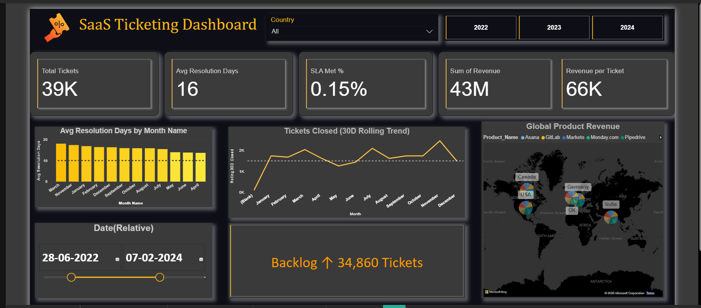

# 📊 SaaS Ticketing Dashboard (Power BI)

This project showcases a **Power BI dashboard** built to track SaaS support/ticketing KPIs.  

### 🔹 Key Features:
- **Total Tickets** – Count of tickets handled  
- **Avg Resolution Days** – Average time to resolve tickets  
- **SLA Met %** – Percentage of tickets resolved within SLA  
- **Revenue Insights** – Sum of revenue & revenue per ticket  
- **Trend Analysis** – 30-day rolling trend of tickets closed  
- **Geographical Insights** – Global product revenue distribution  

---

### 📌 Dashboard Preview  

---

### 🛠️ Tech Stack
- **Power BI Desktop**
- **DAX** for calculated measures
- **Data Modeling** with relationships

---

### 🚀 How to Use
1. Browse the screenshots included in this repository.  
2. Refer to the README for explanations of metrics and insights.
3. Review the dashboard design, KPIs, and visuals.  

---

### 📄 About
This dashboard is designed to demonstrate **SaaS support analytics** and is part of my **data analytics portfolio**.

