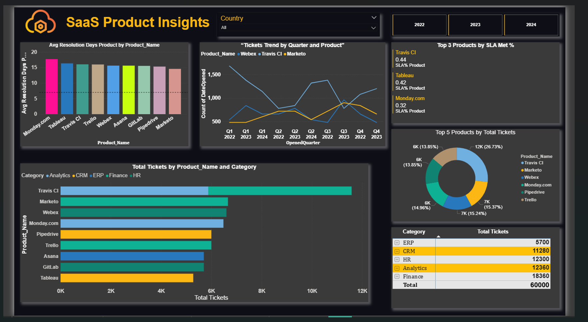

# 📊 SaaS Ticketing Dashboard (Power BI)

This project showcases a **Power BI dashboard** built to track SaaS support/ticketing KPIs.  

### 🔹 Key Features:
- **Total Tickets & Category Split** –Track overall ticket volume (60K) by different business function
- **Avg Resolution Days** – Monitor efficiency of issue resolution across months and products.  
- **SLA Met %** – Measure service quality by tracking compliance with SLA targets.  
- **Revenue Insights** – View total revenue, revenue per ticket, and global revenue distribution.  
- **Trend Analysis** – Identify patterns with 30-day rolling closure trends and quarterly ticket trends.  
- **Product Insights** – Compare Top 5 Products by ticket volume and Top 3 Products by SLA performance.  
- **Geographical Insights** – Analyze product adoption and revenue share across countries.  

---

### 📌 Dashboard Preview  

---
## 📊 Page 1 – Executive Dashboard

- Displays key KPIs: Total Tickets (39K), Avg Resolution Days, SLA %, Revenue (43M), and Revenue per Ticket (66K).
- Highlights monthly resolution patterns and 30-day ticket closure trends.
- Shows backlog status (34K tickets) to track pending workload.
- Provides global revenue distribution by country and product.

---

### 📌 Dashboard Preview  

---

## 📊 Page 2 – Product Insights
- Tracks **Avg Resolution Days** by product to measure efficiency.
- Shows **ticket volume trends** by quarter and product.
- Highlights **Top 5 Products by Tickets** and **Top 3 Products by SLA Met %**.
- Breaks down tickets by **Product & Category** for cross-functional analysis.

---
### ⚙️ Power BI Workflow

- **Data Import** – Connected ticketing & product tables into Power BI.  
- **Data Modeling** – Established relationships (R/Ps) between tickets, products, categories, and dates.  
- **DAX Measures** – Created custom KPIs (Avg Resolution Days, SLA %, Revenue per Ticket).  
- **Report View** – Designed dashboards with interactive slicers, charts, and KPIs.  
- **Insights Delivery** – Combined executive metrics (Page 1) with product-level insights (Page 2).  

---

### 🛠️ Tech Stack
- **Power BI Desktop**
- **DAX** for calculated measures
- **Data Modeling** with relationships

---

🚀 Business Value

- Helps leadership monitor overall workload, SLA compliance, and revenue trends across functions.

- Enables product managers to track efficiency, adoption, and quality performance of SaaS tools.

- Provides actionable insights for resource allocation, backlog reduction, and SLA improvements.

- Supports data-driven decisions for scaling SaaS operations and improving customer satisfaction.

---

### 🚀 How to Use
1. Browse the screenshots included in this repository.  
2. Refer to the README for explanations of metrics and insights.
3. Review the dashboard design, KPIs, and visuals.  

---

### 📄 About  
This project showcases my ability to design **end-to-end Power BI dashboards** with strong skills in:  
- **Data Modeling** (relationships & schema design)  
- **DAX** (custom measures & KPIs)  
- **Business Storytelling** (executive + product-level insights)  

It is part of my **data analytics portfolio** and demonstrates how Power BI can turn raw SaaS support data into **actionable business intelligence**.  

